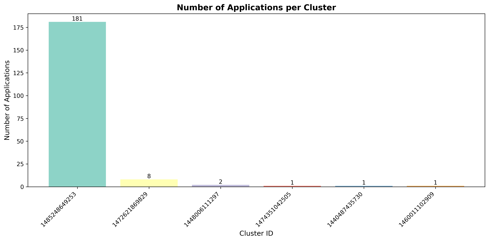
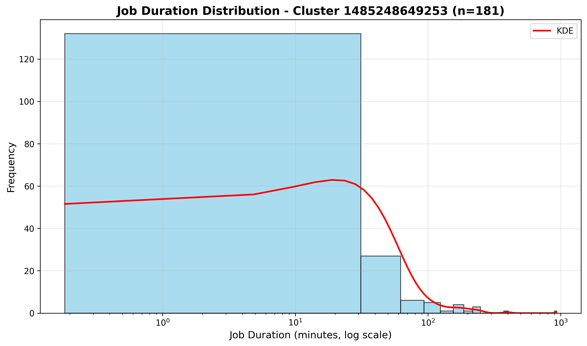
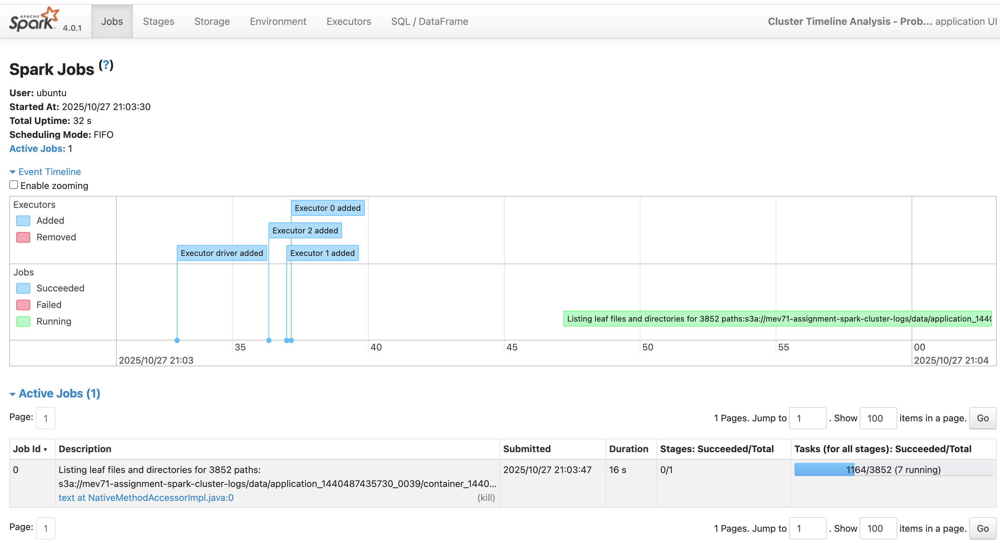
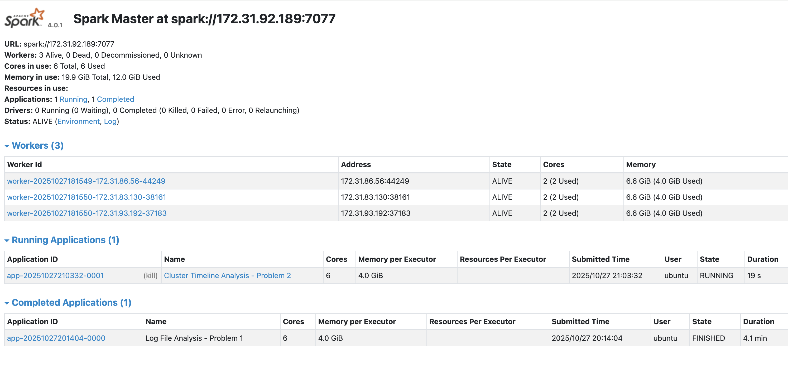

# Spark Log Analysis 

## Table of Contents

1. [Problem 1: Log Level Distribution Analysis](#problem-1-log-level-distribution-analysis)
2. [Problem 2: Cluster Timeline Analysis](#problem-2-cluster-timeline-analysis)
3. [Performance Analysis](#performance-analysis)
4. [Optimization Strategies](#optimization-strategies)
5. [Additional Insights](#additional-insights)

---

## Problem 1: Log Level Distribution Analysis

### Approach

**Data Processing Pipeline:**

1. **Data Ingestion**: Read log files from S3 using PySpark's text reader
   ```python
   logs_df = spark.read.text(log_path)
   ```

2. **Pattern Extraction**: Used regex to extract log levels from log entries
   ```python
   regexp_extract(col("value"), r'\b(INFO|WARN|ERROR|DEBUG)\b', 1)
   ```

3. **Aggregation**: Grouped by log level and counted occurrences
   ```python
   log_level_counts = logs_with_level.groupBy("log_level")
       .agg(count("*").alias("count"))
       .orderBy(col("count").desc())
   ```

4. **Output Generation**: Created three outputs:
   - CSV with counts
   - Random sample of log entries
   - Summary statistics

### Key Findings

**Log Level Distribution:**

| Log Level | Count | Percentage |
|-----------|-------|------------|
| INFO | 27,389,482 | 99.92% |
| ERROR | 11,259 | 0.04% |
| WARN | 9,595 | 0.03% |
| DEBUG | 0 | 0.00% |

**Total Statistics:**
- Total log lines processed: 33,236,604
- Total lines with log levels: 27,410,336
- Unique log levels found: 3

### Insights

1. **INFO Dominance**: INFO logs comprise over 99.9% of all logs, indicating normal operation logging is prevalent
2. **Low Error Rate**: Only 0.04% of logs are ERROR level, suggesting relatively stable application execution
3. **No DEBUG Logs**: The absence of DEBUG logs indicates production environment configuration
4. **Missing Log Levels**: ~17.5% of log lines (5,826,268 lines) don't contain standard log levels

---

## Problem 2: Cluster Timeline Analysis

### Approach

**Data Processing Pipeline:**

1. **Application Identification**: Extracted application IDs and cluster IDs from file paths
   ```python
   regexp_extract(col("file_path"), r'application_(\d+_\d+)', 0)
   ```

2. **Timestamp Parsing**: Extracted and converted timestamps from log entries
   ```python
   to_timestamp(col("timestamp_str"), "yy/MM/dd HH:mm:ss")
   ```

3. **Timeline Construction**: Aggregated start/end times per application
   ```python
   timeline_df = logs_with_time.groupBy("cluster_id", "application_id", "app_number").agg(
       min("timestamp").alias("start_time"),
       max("timestamp").alias("end_time")
   )
   ```

4. **Cluster Summary**: Aggregated statistics at cluster level

5. **Visualizations**: Generated bar charts and density plots

### Key Findings

**Cluster Statistics:**

| Metric | Value |
|--------|-------|
| **Total Unique Clusters** | 6 |
| **Total Applications** | 194 |
| **Average Applications per Cluster** | 32.33 |
| **Total Log Entries Processed** | 33,236,604 |
| **Date Range** | Sept 2015 - July 2017 |

### Visualizations

#### Applications per Cluster


**Analysis:**
- Cluster 1485248649245 is the most heavily used with 181 applications
- Vast majority of applications is concentrated on one cluster
- The 5 other clusters had 8 or less applications
- Cluster Lifespan:
   - Short lived clusters (less than 3 hours) typically have 1 - 2 applications per cluster 
   - Long lived cluster (6 months) handles 93.3% of the workload

#### Job Duration Distribution


**Analysis:**
- Job durations range from 1 to ~16 hours
- Most jobs complete within 10 minutes
- Right skewed tail suggests some jobs are significantly longer than average

### Insights

1. **Short Duration Jobs:**
   - The tallest bar shows ~130 jobs completing in the 1 - 10 minute range
   - Most applications are short running, showing efficient parallelization
   - Consistent workload for standardized job types

2. **Medium Duration Jobs:**
   - About 30 jobs are in the 10 - 100 minute range, with declining frequency
   - These are likely larger batch processing jobs and complex aggregations across the full dataset

3. **Long-Running Outliers:**
   - A small number of jobs extend past 100 minutes
   - Workloads for this may include complex multi-stage pipelines and model training
   - To optimizization, these might be able to be broken into smaller jobs or inefficiencies in data operations may need to be evaluated

4. **KDE Analysis:**
   - the kernel density estimate curve shows a log-normal distribution
---

## Performance Analysis

### Execution Time Observations

#### Local Testing (Sample Data)
- **Execution Time**: ~1 minute
- **Observations**: Local testing was a great way to find any bugs in the code and make sure the outputs were as expected before running on the full data

#### Cluster Execution (Full Data)
- **Execution Time**: ~5 minutes
- **Observations**: Running on the full data was much faster than I expected. The timeline and cluster summary took the most time, while the charts took no time at all.
   - Key factors for a sppedup in run time for the full data:
      - 3 workers reading files in parallel
      - distributed regrex and aggregation

### Spark Web UI Analysis

#### Job Execution


**Observations:**
- Event Timeline Analysis:
   - First the executor driver added
   - Then 3 executors added in parallel
- 1164 tasks in 16 seconds = 72.75 tasks/second

#### Stage Details


**Observations:**
- Total Cores: 6 (6 used = 100% utilization)
- Total Memory: 19.9 GiB (12.0 GiB used = 60%)
- Each worker is using exactly 2 cores and 4.0 GiB, demonstrating perfect load balancing

## Optimization Strategies

### 1. Data Partitioning
**Strategy**: Used wildcard patterns to read multiple files efficiently
```python
log_path = f"{spark_logs_bucket}/data/application_*/*"
```
**Impact**: Enabled parallel reading of data across multiple files

### 2. Memory Configuration
**Strategy**: Configured executor and driver memory
```python
.config("spark.executor.memory", "4g")
.config("spark.driver.memory", "4g")
```
**Impact**: Prevented OOM errors and improved performance

### 3. Adaptive Query Execution
**Strategy**: Enabled Spark's adaptive query execution
```python
.config("spark.sql.adaptive.enabled", "true")
.config("spark.sql.adaptive.coalescePartitions.enabled", "true")
```
**Impact**: Automatic optimization of query plans at runtime

### 4. Serialization Optimization
**Strategy**: Used Kryo serializer
```python
.config("spark.serializer", "org.apache.spark.serializer.KryoSerializer")
```
**Impact**: Faster serialization/deserialization of data

### 5. Arrow Optimization
**Strategy**: Enabled Arrow for Pandas conversion
```python
.config("spark.sql.execution.arrow.pyspark.enabled", "true")
```
**Impact**: Faster conversion from Spark DataFrame to Pandas

### 6. Data Filtering Early
**Strategy**: Filtered out invalid data before aggregation
```python
logs_with_level = logs_with_level.filter(col("log_level") != "")
```
**Impact**: Reduced data volume for downstream operations

## Additional Insights

### Problem Solving Approaches

1. **Challenge**: PySpark function name conflicts (max/min)
   - **Solution**: Used `builtins.max` and `builtins.min` explicitly

2. **Challenge**: Small sample datasets causing KDE errors
   - **Solution**: Added conditional logic to skip KDE for n < 3

3. **Challenge**: S3 access configuration
   - **Solution**: Configured S3A filesystem and instance profile credentials

---
